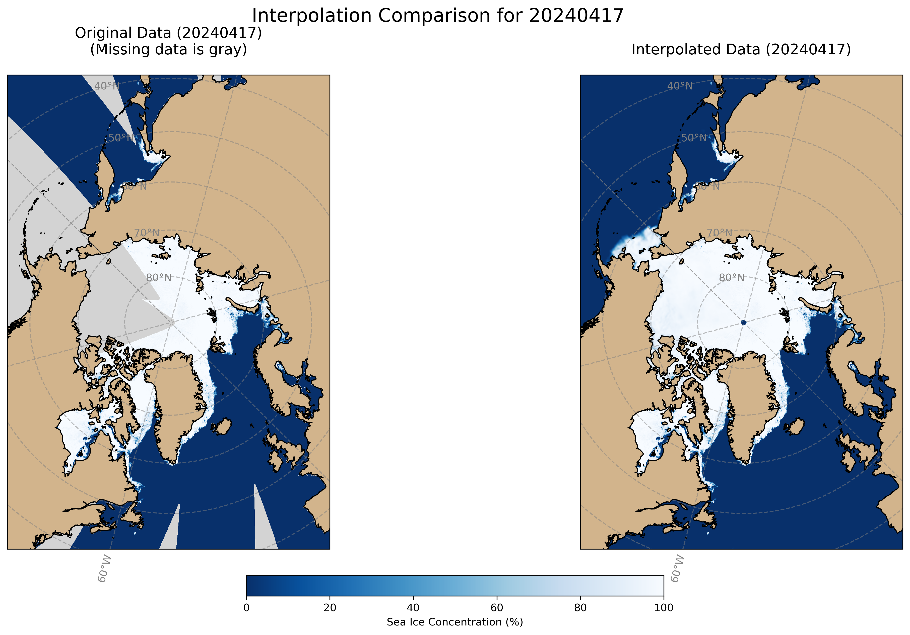
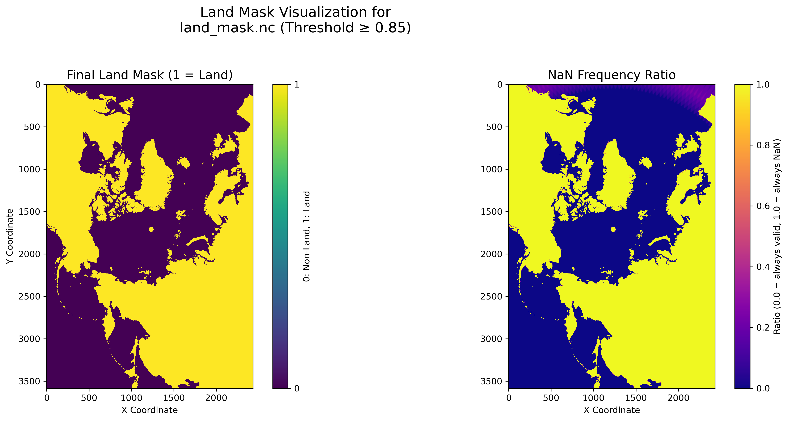

# AMSR2 Sea Ice Data Preprocessing Toolbox 🧊
[中文文档](readme.md)

[](https://opensource.org/licenses/MIT)
[](https://www.python.org/)
[](https://pytorch.org/)
[](https://github.com/psf/black)

A highly efficient and user-friendly preprocessing pipeline designed specifically for **AMSR2 Sea Ice Concentration data**. From data downloading and spatio-temporal interpolation to generating a PyTorch `DataLoader` ready for deep learning, it's a one-stop solution for all your preprocessing needs.

---

## ✨ At a Glance: From Raw Data to Usable Features

| **Core Feature: High-Performance Spatio-temporal Interpolation** | **Auxiliary Feature: Land Mask Generation** |
| :---: | :---: |
|  |  |
| *Left: Raw data (with significant missing values); Right: Interpolated data* | *Accurate land/ocean mask generated from long-term data statistics* |

---

## 🎯 Target Data Source

This toolbox is **specifically** optimized and designed for the following dataset:

-   **Data Center**: [University of Bremen](https://data.seaice.uni-bremen.de/amsr2/)
-   **Product**: `asi_daygrid_swath`
-   **Resolution**: `n3125`
-   **Format**: `netcdf`

Direct link: [uni-bremen.de/amsr2/asi_daygrid_swath/n3125/netcdf/](https://data.seaice.uni-bremen.de/amsr2/asi_daygrid_swath/n3125/netcdf/)

---

## 🚀 Quick Start (4 Steps)

### 1. Environment Setup

Clone this repository and install the dependencies:

```bash
git clone https://github.com/ghost-him/AMSR2-Sea-Ice-Toolbox.git
cd AMSR2-Sea-Ice-Toolbox
pip install numpy xarray netcdf4 torch torchvision matplotlib cartopy tqdm numba requests python-dateutil
mkdir data
```

### 2. Create Land Mask

To ignore land pixels during training, you can create a mask based on long-term data. The longer the time span of the data, the more accurate the mask will be.

```bash
# Create a mask using the downloaded data with a threshold of 0.85
python create_mask.py \
    --source_dir ./data \
    --start_date 20240401 \
    --end_date 20240430 \
    --output_file ./land_mask.nc \
    --threshold 0.85
```

### 3. Data Processing

Download and consolidate the data. This step will automatically download, merge, and fill missing values using a high-performance interpolation algorithm. The `land_mask_file` is optional, but the resulting dataset will have significant errors without it.

```bash
# Download data for a specific date range (e.g., April 2024)
python download.py --start_date 20240401 --end_date 20240430 -o data

# Consolidate the downloaded daily data into a single file and perform interpolation
python consolidate_data.py \
    --source_dir ./data \
    --start_date 20240401 \
    --end_date 20240430 \
    --output_file ./sea_ice_concentration_202404.nc \
    --land_mask_file ./land_mask.nc
```

### 4. Data Visualization

Multiple visualization tools are provided to help you intuitively check data quality, mask effectiveness, and interpolation results.

#### Visualize Single-Day Raw Data

Using the `visualization.py` script, you can project a single `netcdf` file geographically and plot it as a map with coastlines and gridlines.

```bash
python visualization.py --input_file ./data/asi-AMSR2-n3125-20240417-v5.4.nc
```

#### Visualize Land Mask

Using the `visualize_mask.py` script, you can visualize the binary mask and the `NaN` frequency map generated by `create_mask.py`.

```bash
python visualize_mask.py \
    --input_file ./land_mask.nc \
    --output_file ./land_mask_visualization.png
```

#### Visualize Interpolation Comparison

Using the `visualization_compare_between_full_sic.py` script, you can intuitively compare the raw data and the interpolated data for the same day to evaluate the interpolation effect. The `no_land` parameter can be used to choose whether to display land and gridlines.

```bash
python visualization_compare_between_full_sic.py \
    --original_file ./data/asi-AMSR2-n3125-20240417-v5.4.nc \
    --consolidated_file ./sea_ice_concentration_202404.nc \
    --date 20240417 \
    --no_land
```

### 5. Load into PyTorch (with Mask Application)

Load the data in a `DataLoader` and apply the previously generated land mask.

```python
import torch
import xarray as xr
from utils import ConsolidatedSICDataset
from torch.utils.data import DataLoader

def load_mask_from_nc(mask_path):
    """Loads the land_mask from a netCDF file and converts it to a PyTorch tensor."""
    with xr.open_dataset(mask_path) as ds_mask:
        # Extract the 'land_mask' variable and convert to a float32 torch tensor
        land_mask_tensor = torch.from_numpy(ds_mask['land_mask'].values).float()
    print(f"Successfully loaded mask: {mask_path}, Shape: {land_mask_tensor.shape}")
    return land_mask_tensor

# 1. Load the mask
# Assuming the mask file is at ./land_mask.nc
try:
    mask_tensor = load_mask_from_nc('./land_mask.nc')
    # Move the mask to the appropriate device (e.g., 'cuda' or 'cpu')
    device = torch.device("cuda" if torch.cuda.is_available() else "cpu")
    mask_tensor = mask_tensor.to(device)
except FileNotFoundError:
    print("Warning: Mask file './land_mask.nc' not found. Proceeding without a mask.")
    mask_tensor = None

# 2. Create the dataset instance
dataset = ConsolidatedSICDataset(
    consolidated_file_path='./sea_ice_concentration_202404.nc',
    start_time=20240401,
    end_time=20240430,
    input_length=5,   # Use the past 5 days of data
    pred_length=3     # Predict the next 3 days of data
)

# 3. Create the DataLoader (num_workers=8 is recommended for actual use)
data_loader = DataLoader(dataset, batch_size=4, shuffle=True)

# 4. Iterate through data and apply the mask
inputs, targets = next(iter(data_loader))
inputs, targets = inputs.to(device), targets.to(device)

print(f"Before applying mask - Input shape: {inputs.shape}")
print(f"Before applying mask - Target shape: {targets.shape}")

if mask_tensor is not None:
    # Apply the mask to inputs and targets using broadcasting
    # Mask shape: (H, W), Data shape: (B, T, C, H, W)
    # unsqueeze changes the mask to (1, 1, 1, H, W) to match data dimensions
    inputs = inputs * mask_tensor.unsqueeze(0).unsqueeze(0).unsqueeze(0)
    targets = targets * mask_tensor.unsqueeze(0).unsqueeze(0).unsqueeze(0)
    print("\nMask applied successfully!")

print(f"\nAfter applying mask - Input shape: {inputs.shape}")
print(f"\nAfter applying mask - Target shape: {targets.shape}")

# Now, the land portions in inputs and targets have been zeroed out
# They can be fed into your model for training
```

---

## 🛠️ Toolbox Details

### Core Features

#### 1. `consolidate_data.py` - Data Consolidation & Spatio-temporal Interpolation
Merges scattered daily NetCDF files into a single time-series file and fills missing values using a **Numba JIT-accelerated** spatio-temporal Gaussian weighting algorithm.

-   **High-Performance**: C-level speed for interpolation calculations.
-   **Memory-Friendly**: Batch processing mechanism easily handles decades of data.
-   **Configurable**: Freely adjust spatio-temporal search windows, weights, and other parameters.

<details>
<summary><b>View Detailed Parameters</b></summary>

```bash
python consolidate_data.py \
    --source_dir ./data \
    --start_date 20120812 \
    --end_date 20120831 \
    --output_file ./full_sic.nc \
    --batch_size 30 \
    --time_window 3 \
    --space_window 7 \
    --alpha 15.0 \
    --sigma 7.0
```
- `batch_size`: Number of days to process at once, affects memory usage.
- `time_window`: Temporal search radius (days).
- `space_window`: Spatial search radius (pixels).
- `alpha`: Spatio-temporal balancing factor.
- `sigma`: Gaussian kernel bandwidth.

</details>

#### 2. `utils.py` - Deep Learning Data Loader
Provides the `ConsolidatedSICDataset` class, a PyTorch Dataset designed for spatio-temporal prediction tasks.

-   **Flexible**: Customize input/output sequence lengths, time intervals, etc.
-   **Efficient**: Supports pre-loading data into memory or real-time reading from disk.
-   **Robust**: Automatically filters invalid samples with too many missing values.

<details>
<summary><b>View `ConsolidatedSICDataset` Usage Example</b></summary>

```python
from utils import ConsolidatedSICDataset

dataset = ConsolidatedSICDataset(
    consolidated_file_path='./full_sic.nc',
    start_time=20120812,
    end_time=20120816,
    input_length=2,     # Input sequence length
    input_gap=1,        # Time gap between frames in the input sequence
    pred_gap=1,         # Time gap between frames in the prediction sequence
    pred_shift=1,       # Starting offset of the prediction sequence relative to the input
    pred_length=2,      # Prediction sequence length
    samples_gap=1,      # Time step between samples
    preload_data=False  # False: read in real-time, True: preload into memory
)
```

</details>

### Auxiliary Tools

<details>
<summary><b>`download.py` - Data Downloader</b></summary>

Automatically batch downloads `asi_daygrid_swath` NetCDF data for a specified date range from the [University of Bremen](https://data.seaice.uni-bremen.de/amsr2/) data center.

-   **Resumable Downloads**: Skips existing files by default, avoiding re-downloads.
-   **Automatic Directory Creation**: Saves data in the specified output directory.
-   **Error Handling**: Gracefully handles file not found (404) and other network issues.

**Usage:**
```bash
# Download data from Jan 1 to Jan 10, 2023, to the ./data directory
python download.py --start_date 20230101 --end_date 20230110 --output-dir ./data

# To force overwrite existing files
python download.py --start_date 20230101 --end_date 20230110 -o ./data -f
```
</details>

<details>
<summary><b>`create_mask.py` - Land Mask Generator</b></summary>

Generates a high-precision land/ocean mask by calculating the frequency of missing values (NaN) for each pixel over a long-term dataset. A pixel is marked as land if its missing frequency exceeds a set threshold. It is recommended to use all available data to create the mask for better accuracy.

-   **Statistics-Driven**: More accurate than generic, fixed masks because it's based on real data distribution.
-   **Configurable Threshold**: Flexibly adjust the criteria for classifying land.
-   **Dual Output**: Saves both the final binary mask (0/1) and the original NaN frequency map for analysis.

**Usage:**
```bash
# Create a mask based on data from 2013 to 2023 in the ./data directory
# Uses the default threshold of 0.85 (a point is land if it's NaN >85% of the time)
python create_mask.py \
    --source_dir ./data \
    --start_date 20130101 \
    --end_date 20231231 \
    --output_file ./land_mask_85pct.nc \
    --threshold 0.85
```
</details>

<details>
<summary><b>`visualize_mask.py` - Mask Visualizer</b></summary>

Visualizes the `.nc` mask file generated by `create_mask.py`, showing both the final binary land mask and the NaN frequency ratio map.

**Usage:**
```bash
python visualize_mask.py \
    --input_file ./land_mask_85pct.nc \
    --output_file ./land_mask_visualization.png
```
</details>

<details>
<summary><b>`visualization.py` - Single-Day Data Visualizer</b></summary>

Uses the **Cartopy** library to create a high-quality map of a single raw data file with a North Pole stereographic projection, including coastlines and gridlines.

**Usage:**
```bash
python visualization.py --input_file ./data/asi-AMSR2-n3125-20240417-v5.4.nc
```
</details>

<details>
<summary><b>`visualization_compare_between_full_sic.py` - Interpolation Effect Comparator</b></summary>

Compares the raw data (with missing values) and the interpolated data from `consolidate_data.py` side-by-side for the same day to visually assess the effectiveness of the interpolation algorithm.

**Usage:**
```bash
python visualization_compare_between_full_sic.py \
    --original_file ./data/asi-AMSR2-n3125-20240417-v5.4.nc \
    --consolidated_file ./sea_ice_concentration_202404.nc \
    --date 20240417
```
</details>

<details>
<summary><b>`get_dims.py` - Get Data Dimensions</b></summary>

Quickly reads the dimensions (height and width) of the `z` variable (sea ice concentration) from the first `.nc` file in a specified directory. This is useful for determining the index range of a Region of Interest (ROI).

**Usage:**
```bash
# The script defaults to searching the ./data directory
python get_dims.py
```
</details>

<details>
<summary><b>`find_several_data_in_target_area.py` - ROI Data Quality Analysis</b></summary>

Checks data day-by-day within a given time range and a specified rectangular region (ROI), reporting which days have missing values within the ROI.

-   **Precise Localization**: Helps identify data quality issues in specific areas.
-   **Visual Aid**: Automatically generates an image showing your defined ROI with a red box on the full map for verification.
-   **Quantitative Report**: Details the number and percentage of missing pixels for each problematic date.

**Usage:**
```bash
# Check for missing data in April 2024, in the region with Y-axis index 100-200 and X-axis index 300-400
python find_several_data_in_target_area.py \
    --source_dir ./data \
    --start_date 20240401 \
    --end_date 20240430 \
    --ymin 100 --ymax 200 \
    --xmin 300 --xmax 400
```
</details>

---

## 💡 Technical Highlights

-   **🚀 High-Performance Computing**: The core interpolation algorithm is compiled with **Numba JIT**, significantly boosting processing speed.
-   **🌍 Accurate Geospatial Visualization**: Uses **Cartopy** for North Pole stereographic projection with automatic coastlines and gridlines.
-   **🧠 Deep Learning Ready**: Seamlessly integrated PyTorch `Dataset` and `DataLoader` to let you focus on the model itself.
-   **💾 Memory Optimized**: Smart batching and data loading strategies to handle massive datasets with ease.

---

## 📜 License

This project is licensed under the [MIT License](LICENSE).

## 🙏 Acknowledgements

-   **Data Source**: [University of Bremen Sea Ice Remote Sensing Group](https://seaice.uni-bremen.de/start/)
-   **AI-Assisted Development**: Google Gemini 2.5 Pro, Anthropic Claude 4 Sonnet
-   **Core Dependencies**: NumPy, xarray, PyTorch, Cartopy, Numba, and other excellent open-source projects.